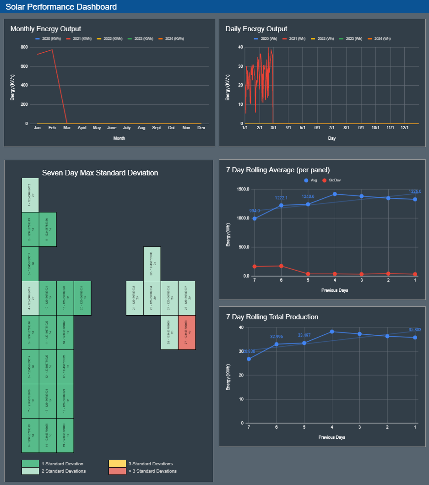

# python_enlighten_api
Enphase Enlighten API & Google Sheets application to pull data and monitor panel performance and populate a Google Sheet with historical and visual data. This allows tracking individual panel performance over the lifetime of the system. Most of the functionlaity provided here is also provided by the Enphase Enlighten website and app, but this allows for granular panel tracking and performance over time.

For example: the panel underperforming (red) is partially blocked by a neighbor's tree during the morning hours. So it's reporting performance outside a few standard deviations.

   

## Requirements
Requires Python 3.6.8 or later installed. Much effort has been taken to ensure this application does not require additional modules besides what is included standard with Python.

    pip install requests
    pip install --upgrade google-api-python-client google-auth-httplib2 google-auth-oauthlib

## Getting Started

### Script/API Setup
1. Allow app access to your Enlighten Account:
    * Follow the instructions here to add a new application to your developer account: https://developer.enphase.com/docs/quickstart.html
2. Open run_inverter_daily_stats.py and set the following in the User Settings section:
    * user_id: within MyEnlighten go to your account Settings and find the API Settings user ID
    * site_id: within MyEnlighten the Site ID should be displayed (or if using the web browser should be in the URL [https://enlighten.enphaseenergy.com/pv/systems/:SITE_ID/overview]
    * api_url: The Enphase API, most likely: https://api.enphaseenergy.com/api/v2/systems
    * api_key: within the https://developer.enphase.com/admin/applications page copy your app's API Key
    * spreadsheet_id: The SpreadSheet ID from Google Sheets. See step 5.
4. Setup a Google API key for your python script and put the following files in your main working script directory: credentials.json, token.pickle.
    * https://developers.google.com/sheets/api/quickstart/python
    * Allow your API token to access your Google Sheets account: https://console.developers.google.com/apis/api/sheets.googleapis.com/overview?
5. Google Sheet Setup
    * The google sheet can be accessed from: https://docs.google.com/spreadsheets/d/1JPnT5T4xvDIKaefL8Z7AoxRNFv6HnVBF7SH-J9Yqfdk. It is a working copy of an example system setup. You may need to manually clear and remove data to use.
How to Setup: 
        1. You'll need to make a copy of this sheet to your personal Google Drive.
        2. Populate each of your inverter serial numbers into the 'Panel Data-Template' Sheet.
        3. Copy and Paste, using values and transpose, your inverter serial numbers into the 'Last 7 Days' sheet.
        4. Update the 'Dashboard' Sheet panel layout to match your panels.
        5. Update the 'Dashboard' Sheet panel numbers and serial numbers to match your panel data
            * Note: Enphase Enlighten did not provide a good way to do this. So I manually had to match up each inverter serial number with the panel number in the layout by tracking panel energy produced over a few days on the 'Panel Data-<Year>' sheet vs the Enphase Enlighten website/app. After a few days each panel's historical data output allowed me to match up each panel on the Dashboard/Panel Data Sheet with the layout of the Enphase app.

### Running
The Enlighten API has a long lag time between when data is updated on their end. If you run these scripts once a day after the Enlighten data updates AND before your solar is producing power (e.g.: 4am) you get the total lifetime power produced by each inverter, including the previous day.

Run with run_inverter_daily_stats.sh or copy the logic this script is using.

#### Setting Automated Cron Jobs
If you're using Linux, you can add these scripts to crontab jobs to run automatically at night by:

Run:

    >crontab -e
Add a crontab job:

    # At 4am local time run the python script via shell script to ensure we're in the right directory
    0 4 * * * /home/<user>/python_enlighten_api/run_inverter_daily_stats.sh >> /home/<user>/python_enlighten_api/cron.log 2>&1

## Enphase Enlighten API Documentation

* https://developer.enphase.com/docs

## Scripts Explanation

This repository contains a few scripts used to hit the Enphase Enlighten API and collect data. The scripts inclide:

### run_inverter_daily_stats.py

Runs the Enlighten API route 'inverters_summary_by_envoy_or_site' to collect the lifetime energy produced by each inverter. The Enphase API lacks the granulatiry of seeing per inveter daily states (documented here: https://developer.enphase.com/forum/topics/per-inverter-stats). So this script provides a means to do that. If you call this route once a day before your solar is producing power (e.g.: 4am) you get the total lifetime power produced by each inverter, including the previous day. If you track this total lifetime energy value every day, you can then subtract the current day's total from the previous day lifetime total. That gives you the daily production value for that inverter. Note: if your Envoy is connected via low bandwidth Cellular, data only refreshes to Enlighten every 6 hours. So perform this route the next day in the early morning to ensure you get complete data.

The resulting data is stashed in a .json file. The file organizes the data by microinverter (by ID), then by day. So you can easily parse this historical data for daily production values.
For example:

    {
        "micro_inverters":
        {
            "12345678":
            {
                "2020-10-14":
                {
                    "daily_energy": 0,
                    "lifetime_energy": 69496
                },
                "2020-10-15":
                {
                    "daily_energy": 2,
                    "lifetime_energy": 69498
                }
            },
            "12345679":
            {
                "2020-10-14":
                {
                    "daily_energy": 0,
                    "lifetime_energy": 68967
                },
                "2020-10-15":
                {
                    "daily_energy": 7,
                    "lifetime_energy": 68974
                }
            },
        }
    }

### populat_google_sheet.py
Is run after the Englighten API data has been captured to the specified sheet by:
1. Grab all inverter serial numbers from the linked google sheet's Named Range 'InverterSerialNumbers'
2. Load in captured enlighten historical data (from run_inverter_daily_stats.py)
3. Look for the sheet titled 'Panel Data-<Current Year>' or duplicate it from 'Panel Data-Template' if it's not found
4. Match up the Enlighten serial number list order vs the InverterSerialNumber range data and filter the data by the current day
5. Insert the data into the 'Panel Data-<Current Year>' sheet
